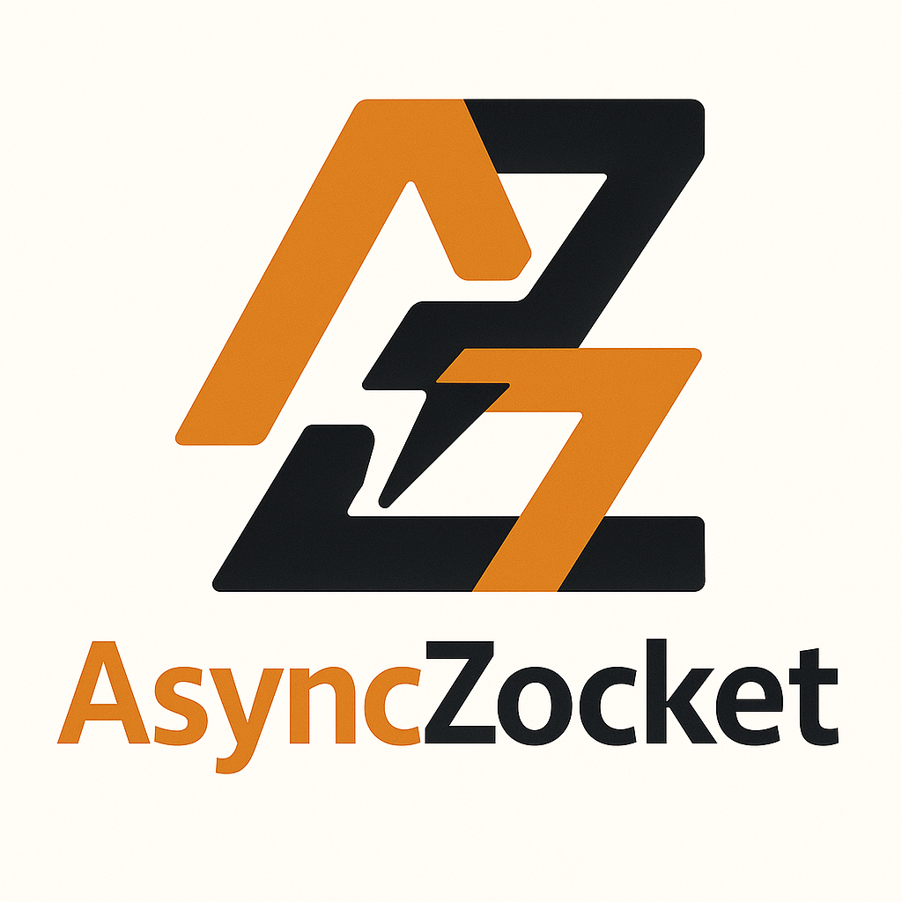

<p align="center">
  
</p>

# AsyncZocket

## Overview

AsyncZocket is a comprehensive WebSocket library for the Zig programming language, providing both client and server implementations. Built on the `xev` event loop library for high-performance asynchronous I/O operations, it offers a robust foundation for real-time communication applications. The library supports the full WebSocket protocol (RFC 6455) and can handle multiple concurrent connections efficiently on a single thread.

## Features

### Core WebSocket Support
*   **Full RFC 6455 Compliance:** Complete implementation of the WebSocket protocol specification
*   **Frame Types:** Support for Text, Binary, Close, Ping, and Pong frames
*   **Proper Masking:** Client-side frame masking and server-side unmasking
*   **Control Frame Handling:** Automatic Ping/Pong responses and proper Close handshake

### Client Implementation
*   **Non-blocking Client:** Asynchronous WebSocket client with connection queuing
*   **Connection Management:** Automatic reconnection and connection state tracking
*   **Write Queuing:** Buffers write operations before connection establishment
*   **Flexible Configuration:** Configurable host, port, and path parameters

### Server Implementation
*   **High-Performance Server:** Multi-client server with configurable connection limits
*   **Connection Pooling:** Efficient management of concurrent client connections
*   **Callback-Based API:** Event-driven architecture with customizable handlers

### Technical Features
*   **Asynchronous I/O:** Built entirely on `xev` for non-blocking operations
*   **Memory Efficient:** Smart buffer management and connection pooling
*   **Single-Threaded:** Efficient event-loop based concurrency model

## Getting Started

### Installation

Use fetch:
```
zig fetch --save https://github.com/Thomvanoorschot/async_zocket/archive/main.tar.gz
```

Or add AsyncZocket to your `build.zig.zon`:

```zig
.dependencies = .{
    .async_zocket = .{
        .url = "https://github.com/thomvanoorschot/async_zocket/archive/main.tar.gz",
        .hash = "...", // Update with actual hash
    },
},
```

### Basic Client Usage

```zig
const std = @import("std");
const AsyncZocket = @import("async_zocket");
const xev = @import("xev");

// Initialize event loop
var loop = try xev.Loop.init(.{});
defer loop.deinit();

// Define message callback
const wrapperStruct = struct {
    const Self = @This();
    fn read_callback(context: *anyopaque, payload: []const u8) !void {
        // You can access the context by casting it to the correct type
        // const self = @as(*Self, @ptrCast(context));
        // self.read_callback(self.callback_context, payload);
        std.log.info("read_callback: {s}\n", .{payload});
        _ = context;
    }
};
var ws = wrapperStruct{};

// Create and connect client
var client = try AsyncZocket.Client.init(
    std.heap.page_allocator,
    &loop,
    .{
        .host = "127.0.0.1",
        .port = 8080,
        .path = "/ws",
        .use_tls = true
    },
    wrapperStruct.read_callback,
    @ptrCast(&ws)
);

try client.connect();

// Send a message
try client.write("Hello, WebSocket!");

// Run event loop
try loop.run(.until_done);
```

### Basic Server Usage

```zig
const std = @import("std");
const AsyncZocket = @import("async_zocket");
const xev = @import("xev");

// Initialize event loop
var loop = try xev.Loop.init(.{});
defer loop.deinit();

// Define callbacks
const wrapperStruct = struct {
    const Self = @This();
    fn accept_callback(
        _: ?*anyopaque,
        _: *xev.Loop,
        _: *xev.Completion,
        cc: *ClientConnection,
    ) xev.CallbackAction {
        cc.read();
        return .rearm;
    }
    fn read_callback(
        context: ?*anyopaque,
        payload: []const u8,
    ) void {
        _ = context;
        std.log.info("read_callback: {s}", .{payload});
        std.heap.page_allocator.free(payload);
    }
};
var ws = wrapperStruct{};

// Create and start server
var server = try AsyncZocket.Server.init(
    std.heap.page_allocator,
    &loop,
    .{
        .host = "127.0.0.1",
        .port = 8081,
        .max_connections = 10,
    },
    @ptrCast(&ws),
    wrapperStruct.accept_callback,
    wrapperStruct.read_callback,
);

server.accept();

// Run event loop
try loop.run(.until_done);
```

## API Reference

### Client

- `Client.init()` - Initialize a new WebSocket client
- `client.connect()` - Connect to the WebSocket server
- `client.write()` - Send a text message
- `client.read()` - Start reading incoming messages
- `client.deinit()` - Clean up client resources

### Server

- `Server.init()` - Initialize a new WebSocket server
- `server.accept()` - Start accepting client connections
- `server.returnConnection()` - Return a closed connection to the pool
- `server.deinit()` - Clean up server resources

### Configuration

**ClientConfig:**
- `host: []const u8` - Server hostname or IP address
- `port: u16` - Server port number
- `path: []const u8` - WebSocket endpoint path
- `use_tls: bool` - Encrypts traffic

**ServerOptions:**
- `host: []const u8` - Server hostname or IP address
- `port: u16` - Server port number
- `max_connections: u31` - Maximum concurrent connections (default: 1024)

## Project Status

🚀 **Production Ready** - The library implements a complete WebSocket solution with both client and server capabilities.

**Implemented Features:**
- Full WebSocket protocol (RFC 6455) compliance
- Client and server implementations
- All frame types (Text, Binary, Control frames)
- Proper masking and unmasking
- Connection management and pooling
- Asynchronous I/O with xev
- SSL/TLS support 


## Requirements

- **Zig 0.15.0-dev** or later

## Contributing

Contributions are welcome! Please feel free to submit pull requests, report bugs, or suggest features.

## License

This project is licensed under the MIT License - see the LICENSE file for details.
